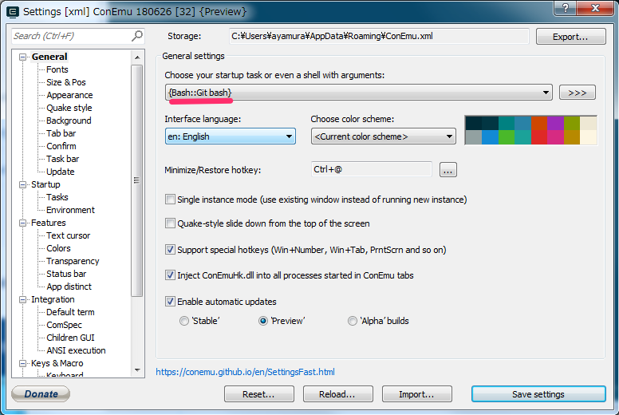

# Lesson 1: 環境構築(Windows編)
まっさらな環境で試せていないので、手順に漏れがあるかもしれません。  
上手くいかなかったら教えてください。

## Git
`GIT CMD`、`GIT Bash`がインストールされていなければインストールしてください。  
コマンド操作はUNIXコマンドが使用できる`GIT Bash`がおすすめです。  
以降、別Lessonを含め、コマンド操作サンプルのプロンプトは`$`で統一しますが、UNIXコマンド以外はコマンドプロンプトでも動くはずです。

バージョンを確認。
```
$ git version
git version 2.5.3.windows.1
```
2系なら大丈夫かと思います。

## Source Treeのインストール
GitのGUIツールです。  
下記サイトよりインストールしてください。  
https://ja.atlassian.com/software/sourcetree  

現在、最新版は`3.0.8`です。けっこう更新の早いソフトなので、インストール済みの場合もある程度バージョンが古くなっているようなら更新をおすすめします。  
起動後、アカウントの登録やら必要かもしれませんが、使用できる状態にしておいてください。

## Nodistのインストール
nodeのバージョン管理ツールです。  
複数バージョンのnodeをインストールして切り替えができます。  
複数のプロジェクト毎に依存するnodeのバージョンがずれてきた場合に必要になります。  
下記サイトからダウンロードしてインストールしてください。  
https://github.com/nullivex/nodist/releases  

インストールできたらnodeをインストールします。  
```
$ nodist + v10.11.0
```
使用するnodeのバージョンを指定します。
```
$ nodist 10.11.0
```
ちなみに`.node-version`を作成し、下記の形式でバージョンを書いておくと、フォルダ単位でバージョンを変更できます。
```
v10.11.0
```
nodeのバージョンを確認します。
```
$ node --version
v10.11.0
```

## yarnのインストール
下記サイトよりインストールします。  
https://yarnpkg.com/lang/en/docs/install/#windows-stable  

バージョンを確認します。  
下記と多少ずれていても大丈夫のはずです。

```
$ yarn --version
1.12.3
```

## VSCodeのインストール
https://code.visualstudio.com/
インストーラーをダウンロードして、実行してください。  
tslintのExtensionもインストールしておきましょう。  
https://marketplace.visualstudio.com/items?itemName=eg2.tslint  
上のページの`Install`ボタンを押し、VSCode上でまた`Install`ボタンを押し、インストールを完了させてください。

## ConEmuのインストール
タブの分割やCtrl+Vによる貼り付けが可能なターミナルソフトです。  
このHands onではいずれ3窓同時に見ながら開発を進めることになるので、インストールしておいてください。    
下記サイトよりダウンロードし、インストールします。  
https://conemu.github.io/  
設定でシェルにGit Bashを選んでおきましょう。  
