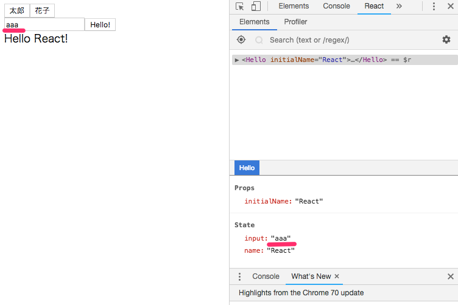

# Lesson 6: React練習

Reactの`props`と`state`の使い方について学んでいきます。  
`props`はReactコンポーネントの引数です。  
コンポーネント作成時に外から渡され、値は不変です。  
一方で`state`の値は可変です。  
名前の通り、変化するコンポーネントの内部**状態**を保持するものと理解してよいでしょう。  
また同じコンポーネントが複数作成される場合、そのstateもコンポーネントの数だけ別々に保持されることを覚えておきましょう。

## propsの追加
Helloコンポーネントにpropsを追加してみましょう。
### client/component/Hello.tsx
まずはpropsのinterfaceを定義します。

```tsx
+ interface Props {
+   initialName: string;
+ }
```
PropsをReact.Componentのジェネリックに指定。
```tsx
- export default class Hello extends React.Component {
+ export default class Hello extends React.Component<Props> {
```
propsはReactコンポーネントの`this`に格納されます。  
`render()`の中で取り出して、値を使ってみます。  
JSXの中で`{}`を囲んだ中はTypeScriptのコードになり、スコープ内で定義された変数やコンポーネントのthis等が使用可能です。

```tsx
  render(): JSX.Element {
+   const { initialName }: Props = this.props;
    return (
-     <div>Hello React!</div>
+     <div>Hello {initialName}!</div>
    );
  }
```

### client/index.tsx
Helloコンポーネントのpropsを定義したので、呼び出し(作成)側でそれを渡してやらなければいけません。
```tsx
-  <Hello />,
+  <Hello initialName="React" />,
```
これでコンポーネントの追加は完了です。
index.tsxから渡す`initialName`の値を変えてやれば、`Hello xxx!`というように画面表示が変わります。  
確認してみましょう。

## stateの追加
画面表示される`Hello `の後の名前をstateにして変更できるようにしてみましょう。
### client/component/Hello.tsx
stateのinterfaceを定義します。
```tsx
+ interface State {
+   name: string;
+ }
```
StateをReact.Componentのジェネリックに指定。
```
- export default class Hello extends React.Component<Props> {
+ sexport default class Hello extends React.Component<Props, State> {
```
class定義の中でstateを定義、初期化します。
```typescript
  export default class Hello extends React.Component<Props, State> {
+ state: State = {
+   name: this.props.initialName,
+ };
  ：
```
`render()`の中の`props.initialName`を`state.name`に変えます。

```tsx
  render(): JSX.Element {
-   const { initialName }: Props = this.props;
+   const { name }: State = this.state;
    return (
-     <div>Hello {initialName}!</div>
+     <div>Hello {name}!</div>
    );
  }
```
これでstateの追加ができましたが、まだ変化はしません。

## stateの変更
stateを変更できるボタンを追加します。

### client/component/Hello.tsx
state.nameを`太郎`と`花子`に変更するメソッドを追加します。
```tsx
  setNameTaro = (): void => {
    this.setState({ name: '太郎' });
  }
  setNameHanako = (): void => {
    this.setState({ name: '花子' });
  }
```
クラスプロパティ`setNameTaro`の型の記述を行うと
```tsx
setNameTaro: () => void = (): void => {
  ：
setNameHanako: () => void = (): void => {
  ：
```
となりますが、冗長ですし却って可読性が下がると思うので省略してよいかと思います。  

`太郎`ボタンと`花子`ボタンを追加します。

```tsx
  render(): JSX.Element {
    const { name } : State = this.state;
    return (
+     <div>
+       <button type="button" onClick={this.setNameTaro}>太郎</button>
+       <button type="button" onClick={this.setNameHanako}>花子</button>
        <div>Hello {name}!</div>
+     </div>
    );
  }
```
`太郎`ボタンを押すと`Hello 太郎!`に、`花子`ボタンを押すと`Hello 花子!`に表示が変わりますか？

### コミット差分1
いったんここまででコミットしておきましょう。  
前回との差分は以下です。  
https://gitlab.com/jabaoplus/webapp-handson-lesson/commit/e5ed8747913d90012d4f389080ceb221feff8d57

## イベントハンドラへの引数の埋め込み
`setNameTaro()`と`setNameHanako()`をひとつにまとめてみましょう。  
`returnSetName()`は引数の`name`を埋め込んだアロー関数を返す関数(**高階関数**)です。  
高階関数については[Lesson 4](docs/lesson04/02_arrow-function.md)でも紹介しましたね。
### client/component/Hello.tsx
```tsx
-  setNameTaro = (): void => {
-    this.setState({ name: '太郎' });
-  }
-  setNameHanako = (): void => {
-    this.setState({ name: '花子' });
-  }
+  returnSetName = (name: string) => (): void => {
+    this.setState({
+      ...this.state,
+      name,
+    });
+  }
```
ちょっと難しいですね。
functionを使って書くとこんな風になります。  
```tsx
  returnSetName = (name: string) => {
    function setName(this: Hello) {
      this.setState({
        ...this.state,
        name,
      });
    }
    setName.bind(this);
    return setName;
  }
```
アロー関数を使わないと`this`をHelloインスタンスと紐付けるための`bind()`が必要になってきます。 
(と思っていたのですが、ここではなくても動くらしい？)  
まあ、このHands onでは`bind()`を使わずに済む書き方をしていきます。  
最初に示した書き方を覚えておきましょう。  

ちなみに型は下記のように書けますが、やめておきましょう(^ ^)

```tsx
  returnSetName: (name: string) => () => void = (name: string): () => void => (): void => {
```


`returnSetName()`を`setNameTaro()`と`setNameHanako()`の代わりにボタンのイベントハンドラに設定します。

```tsx
-     <button type="button" onClick={this.setNameTaro}>太郎</button>
-     <button type="button" onClick={this.setNameHanako}>花子</button>
+     <button type="button" onClick={this.returnSetName('太郎')}>太郎</button>
+     <button type="button" onClick={this.returnSetName('花子')}>花子</button>
```

## テキストボックスの追加
名前を入力できるようにしてみましょう。  
まずは、入力中の内容を保持する`state`のプロパティを追加します。
### client/component/Hello.tsx
```typescript
 interface State {
   name: string;
+  input: string;
 }
 export default class Hello extends React.Component<Props, State> {
   state: State = {
     name: this.props.initialName,
+    input: '',
   };
     ：
```

太郎ボタン、花子ボタンをの下にテキストボックスと`Hello!`ボタンを追加します。  
テキストボックスの`value`に先程定義した`state.input`を設定しましょう。  
こうすることで`state.input`の内容がテキストボックスに表示されるようになります。

```typescript
  render(): JSX.Element {
-   const { name } : State = this.state;
+   const { name, input } : State = this.state;
    return (
      <div>
+       <div>
          <button type="button" onClick={this.setNameTaro}>太郎</button>
          <button type="button" onClick={this.setNameHanako}>花子</button>
+       </div>
+       <input type="text" value={input} />
+       <button>Hello!</button>
        <div>Hello {name}!</div>
      </div>
    );
  }
```

テキストボックスに入力した内容が`state.input`に反映されるようにします。
```typescript
+  handleInputChange = (e: React.ChangeEvent<HTMLInputElement>): void => {
+    this.setState({
+      ...this.state,
+      input: e.target.value,
+    });
+  }
   render(): JSX.Element {
    ：
-         <input type="text" value={input} />
+         <input type="text" value={input} onChange={this.handleInputChange} />
    ：
```
イベントの型の調べ方ですが、あえて`string`などの間違った型を書いてエラーを出してやるとエラーメッセージに推論された型が表示されます。 
Chrome拡張の[React Developer Tools](https://chrome.google.com/webstore/detail/react-developer-tools/fmkadmapgofadopljbjfkapdkoienihi)を使うと`state.input`の内容が変化していることが確認できます。  



`Hello!`ボタン押下で`Hello xxx!`メッセージが変わるようにしましょう。  
テキストボックスは空白に戻します。  

```tsx
  setNameFromInput = (): void => {
    const { input } : State = this.state;
    this.setState({
      name: input,
      input: '',
    });
  }
  render(): JSX.Element {
   ：
-       <button}>Hello!</button>
+       <button onClick={this.setNameFromInput}>Hello!</button>
   ：
```
テキストボックス内でEnterキー押下でもメッセージが変わるようにしましょう。
```tsx
+  handleInputKeyPress = (e: React.KeyboardEvent<HTMLInputElement>): void => {
+    if (e.key === 'Enter') this.setNameFromInput();
+  }
    ：
-        <input type="text" value={input} onChange={this.handleInputChange} />
+        <input type="text" value={input} onChange={this.handleInputChange} onKeyPress={this.handleInputKeyPress} />
```
### コミット差分2
いったんここまででコミットしておきましょう。
前回との差分は以下です。
https://gitlab.com/jabaoplus/webapp-handson-lesson/commit/83a86ec0e7dbaa53d1e91364671488d11adc4982

## Formの利用
Formを使うとテキストボックスのKeyPressイベントの記述は不要になります。  
記述量は減っていないのですが、こちらの方が好まれる書き方かもしれません。  

### client/component/Hello.tsx
テキストボックス、ボタンをFormで包みます。  
ちなみにスタイルなしではFormの下に改行が入るようです。  
* `setNameFromInput()`をFormサブミットのイベントハンドラに設定。
* テキストボックスのKeyPressイベントの設定を削除
* ボタンのクリックイベントの設定を削除
* ボタンをサブミットタイプに変更
```tsx
-        <input type="text" value={input} onChange={this.handleInputChange} onKeyPress={this.handleInputKeyPress} />
-        <button onClick={this.setNameFromInput}>Hello!</button>
+        <form onSubmit={this.setNameFromInput} >
+          <input type="text" value={input} onChange={this.handleInputChange} />
+          <button type="submit">Hello!</button>
+        </form>
         <div>Hello {name}!</div>
```

`setNameFromInput()`の引数にFormイベントを受け取るようにし、通常のサブミット処理(リクエスト処理)を抑止します。

```tsx
- setNameFromInput = (): void => {
+ setNameFromInput = (e: React.FormEvent<HTMLFormElement>): void => {
+   e.preventDefault();
    const { input } : State = this.state;
     ：
```
`handleInputKeyPress()`はもう不要です。

```tsx
-  handleInputKeyPress = (e: React.KeyboardEvent<HTMLInputElement>): void => {
-    if (e.key === 'Enter') this.setNameFromInput();
-  }
```
画面の動作はおかしくなっていないでしょうか。
* `Hello!`ボタンでテキストボックスの内容が`Hello xxx!`メッセージの`xxx`部分に反映。
* テキストボックス内でEnterキー押下でも同様の動作。

### コミット差分3
ここまででコミットしておきましょう。
前回との差分は以下です。
https://gitlab.com/jabaoplus/webapp-handson-lesson/commit/141af707a84b6a7c87b7d3a510508984b9ecf63e

## refの利用
次にReactのrefの使って書き換えてみましょう。  
refによりテキストボックスのDOMの参照を取得し、値の取得・設定を行います  
これにより`state.input`が不要になり、テキストボックスのChangeイベントの制御も不要になります。

### client/component/Hello.tsx
まず、`state.input`の定義と初帰化を削除し、テキストボックスの参照を保持するクラスプロパティを定義します。  
プロパティ名後ろの`!`は未初期化のエラーを抑止するために付けています。

```tsx
 interface State {
   name: string;
-  input: string;
 }
 export default class Hello extends React.Component<Props, State> {
   state: State = {
     name: this.props.initialName,
-    input: '',
   };
+  textInput!: HTMLInputElement;
    ：
```
`handleInputChange()`は不要となるため、削除。  
`setNameFromInput()`では`state.input`の代わりに`textInput`の`value`より、テキストボックスの値を取得、クリアするようにします。
```tsx
-  handleInputChange = (e: React.ChangeEvent<HTMLInputElement>): void => {
-    this.setState({
-      ...this.state,
-      input: e.target.value,
-    });
-  }
   setNameFromInput = (e: React.FormEvent<HTMLFormElement>): void => {
     e.preventDefault();
-    const { input } : State = this.state;
-    this.setState({
-      name: input,
-      input: '',
-    });
+    this.setState({ name: this.textInput.value });
+    this.textInput.value = '';
   }
```
`render()`では`input`変数が不要となるので削除。  
最後に`input`の`ref`の定義です。  
引数として`input`のDOMの参照が渡ってくるので、`this.textInput`に設定しています。
```tsx
   render(): JSX.Element {
-    const { name, input } : State = this.state;
+    const { name } : State = this.state;
      ：
-          <input type="text" value={input} onChange={this.handleInputChange} />
+          <input type="text" ref={(node: HTMLInputElement): void => { this.textInput = node; }} />
```
これでrefを使った書き換えは完了です。

### refを利用すべきか
コード量がかなり減ってスマートな記述のようにも見えますが、実はrefの上記のような使い方は非推奨とされるようです。  
[React公式のドキュメント](https://reactjs.org/docs/refs-and-the-dom.html)では「宣言的に記述できる場合は使わないように」と書かれています。  
「宣言的」とはReactのコンセプトのひとつで、処理を「命令的」に記述するのではなく、求める結果を「宣言的」に書きましょうというようなことです。 
Reactではコンポーネントの表示について定義し、その表示にいたる処理経過は定義しません。  
実際に行われるDOM操作はReactが裏でやってくれるのでプログラマーは記述しない、してはいけない、ということになります。  
この考え方からするとDOMの直接の参照を取得するrefはDOMを直接操作しなければ実現できないことを行う場合以外は使用すべきではない、ということになります。  
このLessonで進めてきたように上記の例はrefを使わなくても実現可能です。  
テキストボックスの内容をstateが保持しなくなる点もReactの考え方としては好ましくない、ということになりそうです。  
[Reduxの公式ドキュメント](https://redux.js.org/basics/usagewithreact)などWeb上でしばしば、refを使ったコードサンプルを見かけるのでReact公式の指針にも関わらず好まれる書き方のようなので紹介しましたが、このHands onではReact公式に従い、refは使用しない方針とします。

### コミット差分4
前回からのコミット差分は下記となります。  
https://gitlab.com/jabaoplus/webapp-handson-lesson/commit/566e714c1206dee16e47f4fc32cee0b02f9fb2ad  
refを利用したソースコードは参考までにコミットしておいてもよいですが、演習に進む前にソースコードをrefの利用前の状態に戻しておきましょう。  

## 演習
ボタンのラベルが可変のコンポーネントを作り、そのコンポーネントからHelloのstate.nameを変更するようにしてみてください。  
下層のコンポーネントから上層のコンポーネントに値を渡してやるには上層からそのstateを変更するメソッドを下層のコンポーネントのpropsとして渡してやるのが定石です。 
また、nameの値は新たに作成するコンポーネント内で渡すようにしてみましょう。  
そのようにするためには、`returnSetName()`は使用できず、新たなメソッドを定義する必要が出てくるはずです。

### 解答例
https://gitlab.com/jabaoplus/webapp-handson-lesson/commit/78aebfead8ab8dcaf24421ea1ef7655cbe3ac68f
