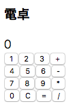

# Lesson 7: Reduxの導入

いよいよReduxを導入していきます。 
まずソースコードを[Lesson 6のフォーム実装後の状態](https://gitlab.com/jabaoplus/webapp-handson-lesson/commit/9f0b675e867f724d2986404b69ca0c9e7595519e)にしてください。  

## Redux概説
Reduxは乱暴に言ってしまうと保守性を保ったままグローバル変数を導入する仕組みです。  
Reduxはアプリケーション全体でひとつの**GlobalState**を持ちます。  
Reactのコンポーネント個別のstateとの混同に注意です。  

Reduxの使用にあたってはまず3つの中心となる概念を理解しましょう。  
**Action**、**Reducer**、**Store**です。

* **Action**
Actionは`GlobalState`を変更するための命令です。

* **Reducer**
ReducerはActionを受け取り、Actionの内容に応じて`GlobalState`の変更を行います。

* **Store**
StoreはReducerとGlobalStateを保持し、ActionをReducerに送ります(`dispatch`)。 
`dispatch()`の呼び出しがReducer処理の契機となります。  
このHans onではStoreに関して書くコードは初期処理以外には`dispatch()`の呼び出しくらいですので上の2つと比べると意識することは少ないかもしれません。

## 実装準備
とりあえずReduxに必要なパッケージをインストールしましょう。
```
$ yarn add redux react-redux @types/react-redux
```

## GlobalStateの定義と初期化
`Hello xxx!`の部分を`greeting`という名前で`GlobalState`に持っていきます。
### client/state.ts
```ts
export interface GlobalState {
  greeting: string;
}
export const initialState: GlobalState = {
  greeting: 'Hello React!',
};
```

## Actionの実装
Actionの実装については、**Action Type**、**Action Interface**と**Action Creator**の3つを実装すると考えるとわかりやすいと思います。  

* **Action Type**  
**コマンド名**と考えてよいでしょう。

* **Action Interface**  
Atcion Typeと一緒に受け渡すデータを含む**Actionオブジェクトの型**です。

* **Action Creator**  
**Actionオブジェクトを作成する関数**です。

ちなみに[公式ドキュメント](https://redux.js.org/basics/actions)で用語として出てくるのは**Action Creator**のみです。  
また、**Action Interface**はTypeScriptでのみ必要となります。   

HelloとGoodbyeアクションを作ってみます。  
さよならを言うときは名前は呼びません。  

### client/actions.ts
```ts
 // Action Types
export enum ActionTypes {
  HELLO = 'HELLO',
  GOODBYE = 'GOODBYE',
}

 // Action Interfaces
export type Action = {
  type: ActionTypes.HELLO,
  payload: {
    name: string,
  },
} | {
  type: ActionTypes.GOODBYE,
};

// Action Creators
export const ActionCreators = {
  hello: (name: string): Action => ({
    type: ActionTypes.HELLO,
    payload: { name },
  }),
  goodbye: (): Action => ({
    type: ActionTypes.GOODBYE,
  }),
};
```

Action Interfaceの定義において、`type`(Action Type)の他に受け渡すデータをまとめて`payload`という名前の任意のオブジェクトとするのがひとつの定番のようです。  
またAction Interfaceをユニオン型としてまとめてexportしているところがポイントです。

**各種命名や定義のまとめ方については私の独自ルールですので、公式ドキュメントで示されているものとは異なります。**

## Reducerの実装

なんとなくGOODBYEアクションが連続で発行された場合は`!`を増やすようにしてみました。  

### client/reducers.ts

```ts
import { GlobalState, initialState } from './state';
import { Action, ActionTypes } from './actions';

export default function reducers(state: GlobalState = initialState, action: Action): GlobalState {
  switch (action.type) {
  case ActionTypes.HELLO:
    {
      const { name } = action.payload;
      return {
        ...state,
        greeting: `Hello ${name}!`,
      };
    }
  case ActionTypes.GOODBYE:
    if (state.greeting.startsWith('Goodbye')) {
      return {
        ...state,
        greeting: `${state.greeting}!`,
      };
    }
    return {
      ...state,
      greeting: 'Goodbye!',
    };
  default:
    return state;
  }
}
```

コードを見てもらえればAction Typeで処理を分岐していることがわかると思います。  

stateを直接変更せずに、変更を込めたstateを新たに作成して返すのがポイントです。  
GlobalStateのプロパティが`greeting`のみなので`...state,`は不要なのですが、いずれプロパティは増えることになるので予め記述しています。  
なにこれ！？と思った人は[簡略記法](docs/lesson04/03_shorthand-expression.md)の**スプレッド構文**を見直しましょう。  

またHELLOの処理では`name`を定義するためにスコープを切っています。  
こうすることでActionが増えてきたときに変数名が重複しないようにしています。

## コンポーネントでのReduxの利用

### client/components/Hello.tsx

まずは必要なモジュールをimportします。

```tsx
+ import { connect } from 'react-redux';
+ import { GlobalState } from '../state';
+ import { Action, ActionCreators as Acc } from '../actions';
```

上で定義した`GlobalState`と`Action`(Action Interfaceのユニオン型)、`ActionCreators`の他、react-reduxより`connect`をimportしています。


Helloのexportをやめ、代わりに`connect()`したHelloをexportします。  
[Redux公式](https://redux.js.org/basics/usagewithreact#presentational-and-container-components)では再利用のため、connect前後のコンポーネントを**presentational components**と**containers components**に分けて定義することが推奨されています。  
このHands onでは特に分けずにまとめてcomponentsとして進めて行きます。

```tsx
- export default class Hello extends React.Component<Props, State> {
+ class Hello extends React.Component<Props, State> {
  　：
  }
+ export default connect(
+   (state: GlobalState): GlobalState => ({ greeting: state.greeting }),
+ )(Hello);
```
`connect()`の第1引数は`mapStateToProps`と呼ばれる関数です。  
とりあえずはGlobalStateからそのコンポーネントが利用するプロパティだけを選択するものと考えてしまってよいかと思います。  
`mapStateToProps()`が選択したプロパティはそのコンポーネントのpropsにマップされます。  
もちろん必要に応じてプロパティを選択するだけでなく、名前や構造を変更することが可能です。  
ただし、頻繁に呼ばれる処理ですので、処理が重くなる場合は[対応](https://redux.js.org/recipes/computingderiveddata)が必要となってきます。  

第2引数は`mapDispatchToProps`と呼ばれる関数です。  
こちらは省略可能で、  省略した場合、`dispatch`がコンポーネントのpropsに格納されます。  
`mapStateToProps`と`mapDispatchToProps`のいずれも**presentational component**を再利用して異なる**containers component**を作成するケースで有用そうです。  
`mapDispatchToProps`の実装は単純なマッピングでもかなりコード量になり、初学者にはわかりにくくなる原因となりますので、このHands onでは`mapDispatchToProps`を省略します。  
`mapStateToProps`も同様に不要という気もしていますが、こちらは省略できません。  
`(state: GlobalState): GlobalState => state`としてスルーしてしまってもいいのですけどね。  
コードの注意点としては`(state: GlobalState): GlobalState => ({ greeting: state.greeting }),`の戻り値`({ greeting: state.greeting })`ですが`()`で囲うのを忘れないようにしましょう。  
`()`がないとオブジェクトリテラル定義の`{}`でなく、関数定義の`{}`と解釈されてしまうのですね。


引き続きHello.tsxの編集です。  
マップした`greeting`とスルーした`dispatch`をPropsに加えます。  
`greeting`の代わりに`initialName`は不要となります。  
```tsx
 interface Props {
-  initialName: string;
+  greeting: string;
+  dispatch: (action: Action) => void;
 }
```
`dispacth()`はActionを引数とする関数です。  


`state.name`は不要となるので削除します。
```tsx
  interface State {
-   name: string;
    input: string;
  }
- export default class Hello extends React.Component<Props, State> {
+ class Hello extends React.Component<Props, State> {
    state: State = {
-     name: this.props.initialName,
      input: '',
      ：
```

Helloクラスに`ActionTypes.HELLO`と`GOODBY`を発行するメソッドを定義します。
```tsx
class Hello extends React.Component<Props, State> {
　：
  hello = (name: string): void => {
    const { dispatch }: Props = this.props;
    dispatch(Acc.hello(name));
  }
  goodbye = (): void => {
    const { dispatch }: Props = this.props;
    dispatch(Acc.goodbye());
  }
　：　
```
`Acc.hello()`と`Acc.goodby()`はAction Creatorです。  
これらが作成するActionを引数に`dispatch()`を呼び出すことにより、Reducerが動いてActionに応じた処理が行われるわけですね。  


`returnSetName()`を`returnHello()`に変更します。  
`state.name`の設定の代わりに、上で定義した`hello()`を呼び出す関数を返しています。
```tsx
-  returnSetName = (name: string) => (): void => {
+  returnHello = (name: string) => (): void => {
-    this.setState({
-      ...this.state,
-      name,
-    });
+    this.hello(name);
   }
```

`setNameFromInput()`を`helloFromInput()`に変更します。  
`state.name`の設定の代わりに、上で定義した`hello()`を呼び出す関数を返しています。  
`state.input`のクリアは元のまま残しています。
```tsx
-  setNameFromInput = (e: React.FormEvent<HTMLFormElement>): void => {
+  helloFromInput = (e: React.FormEvent<HTMLFormElement>): void => {
     e.preventDefault();
     const { input }: State = this.state;
     this.setState({
-      name: input,
       input: '',
     });
+    this.hello(input);
   }
```


最後に`render()`の変更です。
`name`を削除、propsより`greeting`を設定。
```tsx
  render(): JSX.Element {
-    const { name, input } : State = this.state;
+    const { input }: State = this.state;
+    const { greeting }: Props = this.props;
      ：
```

太郎、花子ボタンのClickイベントハンドラを`returnSetName()`を`returnHello()`に変更します。
```tsx
-          <button type="button" onClick={this.returnSetName('太郎')}>太郎</button>
-          <button type="button" onClick={this.returnSetName('花子')}>花子</button>
+          <button type="button" onClick={this.returnHello('太郎')}>太郎</button>
+          <button type="button" onClick={this.returnHello('花子')}>花子</button>
```

フォームSubmitイベントハンドラを`setNameFromInput()`を`helloFromInput()`に変更します。  
```tsx
-        <form onSubmit={this.setNameFromInput}>
+        <form onSubmit={this.helloFromInput}>
```

`GoodBye!`ボタンを追加します。
```tsx
           <button type="submit">Hello!</button>
+          <div>
+            <button type="button" onClick={this.goodbye}>Goodbye!</button>
+          </div>
         </form>
```

メッセージを`greeting`を使ったものに変更します。
```tsx
-        <div>Hello {name}!</div>
+        <div>{greeting}</div>
```

### client/index.tsx
使用するモジュールのimportを追加します。
```tsx
  import * as React from 'react';
  import * as ReactDOM from 'react-dom';
+ import { Provider } from 'react-redux';
+ import { Store, createStore } from 'redux';
  import Hello from './component/Hello';
+ import reducers from './reducers';
```
上で定義した`reducers`(Reducer)を引数として`store`(Store)を作成します。  
これまでルートコンポーネントだった`Hello`はStoreを保持する`Provider`の子コンポーネントとし、代わりに`Provider`をルートコンポーネントとします。  
また、Helloのprops、`initialName`を削除したので、呼び出しからも削除します。  
```tsx
+ const store: Store = createStore(reducers);
  ReactDOM.render(
+   <Provider store={store}>
-     <Hello initialName="React" />
+     <Hello />
+   </Provider>,
    document.querySelector('#app'),
  );
```
ようやくこれで完成、のはずです！  
`太郎`ボタンを押すと`Hello 太郎!`に、`花子`ボタンを押すと`Hello 花子!`に、`Hello!`ボタンを押すと`Hello xxx!`に、`Goodbye!`を押すと`Goodbye!`に表示が変わるでしょうか。  
さらに`Goodbye!`を連続で押すと`!`が増えていくようになっていればOKです！

## Redux Developer Tools
Chrome拡張の[Redux Developer Tools](https://chrome.google.com/webstore/detail/redux-devtools/lmhkpmbekcpmknklioeibfkpmmfibljd)を使うと、ActionによるGlobalStateの変更の履歴等が見られます。  
React Developer Toolsとは違い、こちらはソースコードの変更が必要です。  
```tsx
- const store: Store = createStore(reducers);
+ let store: Store;
+ if (process.env.NODE_ENV !== 'development') {
+   store = createStore(reducers);
+ } else {
+   store = createStore(
+     reducers,
+     (window as any).__REDUX_DEVTOOLS_EXTENSION__ &&
+     (window as any).__REDUX_DEVTOOLS_EXTENSION__(),
+   );
+ }
```

## コミット差分
https://gitlab.com/jabaoplus/webapp-handson-lesson/commit/06eb4abf948fa902a2240e843ab0ad9c37ea868b

## 演習
電卓を作ってみましょう。  
数字以外のボタンは`+` `-` `*` `/` `=` `C`くらいにしておきましょうか。  
  
https://handson-dentaku.herokuapp.com/  
普通の電卓と同じように **1+2+** と入力した時点で表示は **3** となるように。  
`+` `-` `*` `/` `=` を連続で入力した際に表示が変更されないように。  
`C`はオールクリアでいいです。  
下記のような入力、表示になります。  
```
1+2+ → 3
3+ → 6
4= → 10
= → 10
1+C → 0
1+2+ → 3
+ → 3
+ → 3
+ → 3
-2= → 1
```

### ヒント
* 数値の入力時は表示中の値を10倍して入力した数値を足す。
* 演算子ボタンや`=`を入力した際に、前に押された演算子による計算が行われる。  
演算子を保持する必要あり。
* 保持すべき数値は左辺、右辺、計算結果、と考えてみる。
* 表示する数値は左辺 or 右辺 or 計算結果。
その表示状態を保持する。
